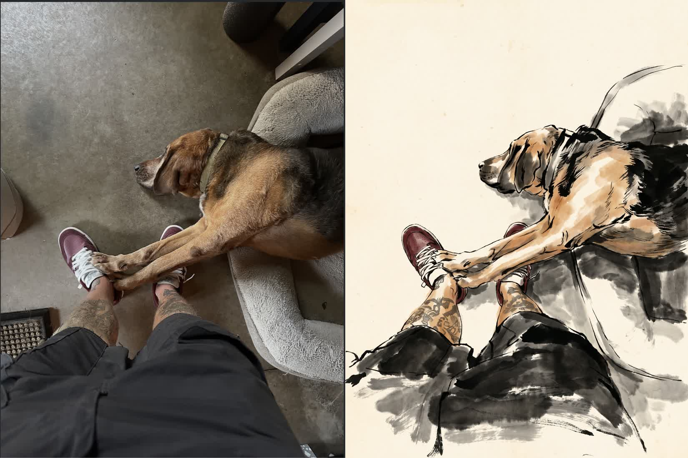

I build pipelines that turn raw recordings into finished media:
phone-call tapes into animated films, screen captures into illustrated
videos, a 14th-century Chinese scroll into a camera move. The
machinery is Node CLIs, FFmpeg, ComfyUI on rented GPUs, and a linter
that runs before any money gets spent.

The repos here are written as build logs. What was tried, what died,
and why it died — the failures are documented on purpose, because
they're the useful part.

Where to start:

- **[media-tools](https://github.com/blessdog/media-tools)** — the
  toolbox. One CLI per media capability; every other project composes
  these.
- **[freqsource](https://github.com/blessdog/freqsource)** — surfaces
  what AI practitioners are actually hitting, not what press releases
  say. Live at [freqsource.com](https://freqsource.com).
- **[blessdog](https://github.com/blessdog/blessdog)** — MCP servers
  that drive Ableton Live. Shares my name because it was here first.
- **[obs-control-room](https://github.com/blessdog/obs-control-room)** —
  Stream Deck → OBS rig, cold-start scripted.
- **[yapzap](https://github.com/blessdog/yapzap)** — voice recorder in,
  transcripts and ideas out.
- **[bible](https://github.com/blessdog/bible)** — the rules I hold my
  own architecture to.

Closed for now: a self-contained speech-to-text app for Mac
([write-on.app](https://write-on.app), for sale soon) and a robot that
applies to jobs.
